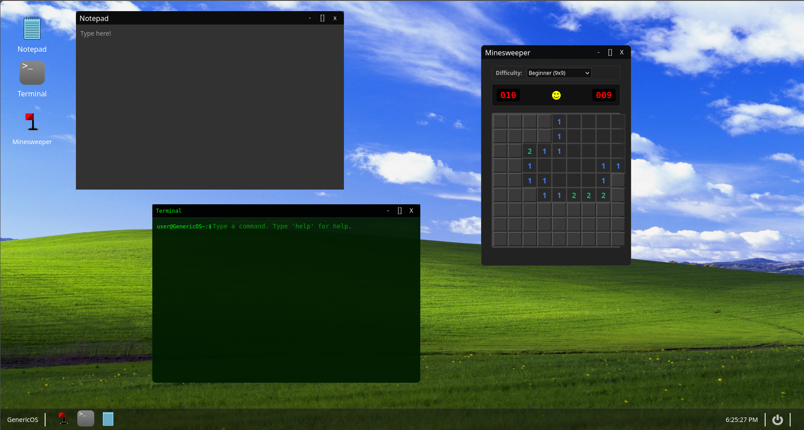
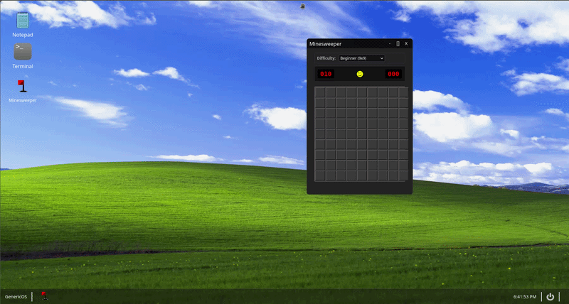

# GenericOS
<span style="font-size: 21px;">A high-quality, open-source, enaging, vanilla "os" in a desktop environment. Interact with it live<a href="https://genericos.jackjacobson2011.com"> here.</a></span>



## Overview & Motivation
This is one my first web-design projects. I wanted to learn how to maniuplate DOM and program verstaile applications in JavaScript so I made this interesting and createive project. The entire project was buily fully from scratch, documented in devlogs and on this Github page (see these devlogs and more at [it's HackClub page](https://stardance.hackclub.com/projects/6676)). 

## Core Features

- Window Managment
    - All windows can be dragged, maximized, minimized, and close through responsive buttons in their headers. They also can be snapped to either side of the screen and maximized by being dragged to the top.
- System UI
    - Features a working taskbar, where you can open, minimize, and see what apps you have
    - Features a live clock and power menu, where you can restart (reload the tab) and power off (close the tab).
- Applications
    - Notepad
        - Type out and store plain text
    - Terminal
        - Enter realistic and reactive commands to get certain outputs
    - Minesweeper
        - Play the popular game of minesweeper! Fully working with three different difficultuies and random field generation.



## Architecture and Technical Information

This project was written in HTML5, CSS3, and vanilla JavaScript. It is organized in to many seperate files. Each application has its own javascript and css file, where all styling and specific programming related to the app goes. The script is then called in the index.html file. System logic is also in its file, such as windowManager.js, which handle functions for moving the windows around the screen. Anything that handles overall OS features should be put outside of the application-specific JavaScript files. All assets, such as images and icons, are held in the assets folder to be referenced in the future.

## Installation and Local Development

If you wanted to adapt the code or view and edit it locally, feel free to do the below.

### 1: Clone the repository

Clone the repositry to your machine <br>
`git clone https://github.com/Jack-Jacobson/GenericOS.git`
<br><br>
Now navigate to the project directory
<br>
`cd GenericOS`

### 2: Opening and viewing the project

There are **two ways to view the project** and see how it responds as you edit the file. Both require both of the above steps completed.

#### Starting a local development server (reccomended):
```
#Starts a development server at http://localhost:8000
python3 -m http.server 8000
```
<br>
Once running, navigate to any web-browser and go to <a href="http://localhost:8000">http://localhost:8000</a>

#### Opening the index.html file:

**If you are on WINDOWS (command prompt)**: <br>
`start index.html`
<br>
**If you are on WINDOWS (powershell)**:<br>
`Start-Process index.html` <br>
**If you are on MACOS**:<br>
`open index.html`<br>
**IF you are LINUX**:<br>
`xdg-open index.html`

## Hosting & Deployment
The website where it is hosted, [genericos.jackjacbson2011.com](https://os.jackjacobson2011.com), is linked via a cloudflare tunnel to a 24/7 linux machine running nginx. Once configured, you cna host any website using these tools. The server is provided free of charge for educational purposes by the nonprofit HackClub Nest.

## Future Roadmap
While this is how the OS will remain for now, in the future I plan non making many more features, such as more games and apps. Bugs will be fixed as they are found, and any security or major issue will be fixed with haste. 

Thank you for checking out my project, and while your here, check out my [portfolio](https://jackjacobson2011.com)! If you are seeing this from HackClub, shoot me a dm on slack for a suprise!